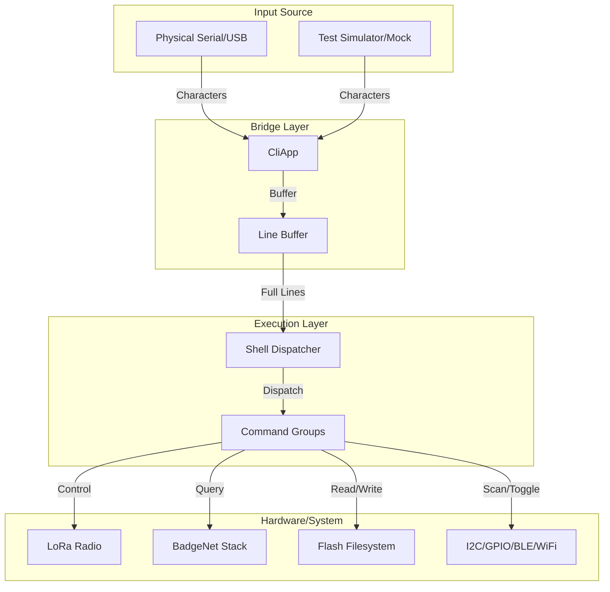

# Badge CLI

The Badge CLI is a robust, Flipper Zero-inspired command-line interface for the Hackaday Supercon 2025 Communicator Badge. It provides deep access to the badge's hardware, network stack, and internal state over a USB serial connection.

## Architecture

The CLI is built as a modular system that decouples I/O handling from command logic, enabling it to run both on physical hardware and in high-fidelity simulations.



### Components

- **`CliApp`** ([apps/cli_app.py](../apps/cli_app.py)): The main entry point. It manages asynchronous I/O, echoes characters back to the terminal, and buffers input until a newline is received.
- **`Shell`** ([shell.py](shell.py)): The core dispatcher. It tokenizes input strings (supporting quoted arguments), manages command registration, and handles command groups.
- **`Commands`** ([commands/](commands/)): Modular Python files that register specific command groups (e.g., `lora`, `storage`, `net`) with the shell.

---

## User Manual

### Getting Started

Connect to your badge via USB Serial at **115200 baud**. Press Enter to see the prompt:

```text
badge >: help
```

### Essential Commands

| Command | Description |
|---------|-------------|
| `help`  | List all top-level commands and groups |
| `neofetch` | System information with ASCII art |
| `uptime` | Time since boot |
| `free`  | Memory heap usage |
| `exit`  | Drop to the MicroPython REPL (>>>) |

### Command Groups

The CLI uses a grouped structure. Type `<group> ?` for sub-commands.

#### `lora` — Radio Control
- `lora info`: Current radio status and signal strength (RSSI/SNR).
- `lora freq [slot]`: Get or set the frequency slot (1-52).
- `lora tx <hex>`: Transmit a raw hexadecimal frame.
- `lora rx`: Enter receive mode and print decoded frames (Ctrl+C to exit).

#### `net` — BadgeNet Stack
- `net address`: Display your 4-byte network address.
- `net nodes`: List all badges seen on the network recently.
- `net ping [addr]`: Send a network-layer ping to another badge.
- `net sniff`: Capture and print all network traffic.

#### `storage` — Filesystem
- `storage list [path]`: List files and directories on flash.
- `storage read <path>`: Print file contents to the terminal.
- `storage write <path> <data>`: Create or overwrite a file.
- `storage remove <path>`: Delete a file or empty directory.

#### `hardware` (i2c, gpio)
- `i2c scan`: Scan the SAO bus for devices.
- `gpio mode <pin> <in|out>`: Set pin direction.
- `gpio read/set <pin>`: Interact with GPIO.

---

## Testing Framework

The CLI includes a comprehensive test suite that runs in CPython, enabling fast development without hardware.

### Running Tests

From the `firmware/` directory:

```bash
# Run all unit and system tests
python -m pytest tests/test_commands.py tests/test_shell.py tests/test_system.py -v

# Run Hardware-In-The-Loop (HITL) Simulation
# This runs the full shell against existing hardware mocks
python -m pytest tests/test_hitl.py --hitl-port mock -v

# Run on Physical Hardware
# This communicates with a real badge over USB
python -m pytest tests/test_hitl.py --hitl-port COM3 -v
```

### HITL Architecture

The Hardware-In-The-Loop system uses a unified `BaseCLIClient` that allows the exact same test cases to run against a `MockBadge` (local simulation) or a `SerialBadge` (physical hardware). This ensures that CLI behavior is consistent across environments.

---

## Extending the CLI

To add a new command group:

1. Create a new file in `badge_cli/commands/yourname_cmd.py`.
2. Define a class `YourNameCommands` that takes `shell` in its `__init__`.
3. Call `shell.register_group("yourname", { ... subcommands ... }, "Description")`.
4. Register your class in `Shell._init_commands()` within `shell.py`.
